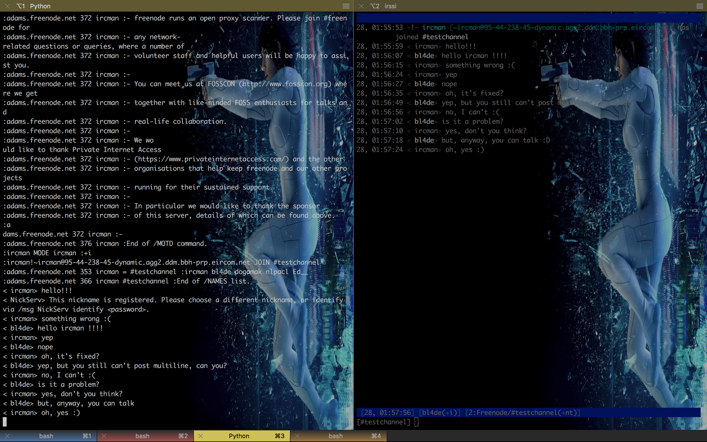

# irc-client

Simple IRC (Internet Relay Chat) Client written in Python 2


## Contributors

Special thanks to Ilie Cebanu (https://github.com/NotQuiteMelvin) for Python 3 version.


## Usage

To join any channel (on Freenode) with selected username, simply run irc_client.py and put desired username as a first argument, followed by channel name (with following # or without):

```
./irc_client.py myusername channeltojoin
```

or

```
./irc_client.py myusername #channeltojoin   // actually not working :)
```

__Seems that passing channel name with following # break script, as Python treats # as the begining of the comment?__


## Sample conversation

This is how it looks right now (left console: irc_client.py, right console: irssi):



## Compiled to .pyc

I've added verison compiled to Python bytecode file (with .pyc extension). Compilation is done by command:

```
$ python -m compileall irc_client.py
```

It might be useful to get binary version instead of cource code.


## Issues and further ideas/features

- multiline messages not working (related to no reposnse from server when no other user post message)
- output sometimes messed by server messages (like PING)
- lack of UX - only simple one line messages can be sent :)
- irc.freenode.net (server) and port 6667 hardcoded - but can be easily added as arguments
- channel name has to be passed without leading ```#```

- colorful output (TBD)


## References

https://en.wikipedia.org/wiki/Internet_Relay_Chat

RFC 1459 (Internet Relay Chat Protocol)                                             
https://tools.ietf.org/html/rfc1459

IRC server response codes reference                                                 
https://www.alien.net.au/irc/irc2numerics.html

RFC 2812 (Internet Relay Chat: Client Protocol):                                
https://tools.ietf.org/html/rfc2812

Other resources:

http://chi.cs.uchicago.edu/chirc/irc_examples.html                                                  
http://books.msspace.net/mirrorbooks/irchacks/059600687X/irchks-CHP-13-SECT-2.html


